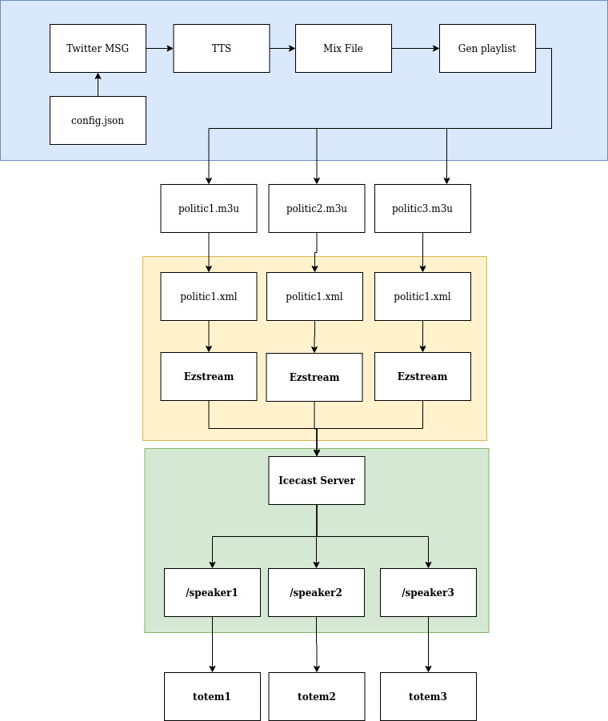

# politics-have-an-argument
Art Installation 

## Requirements
twitter
gtts

ezstream 
icecast server


> pip install -r requirements.txt

## How it works



## Docker setup
Clone this repo
> git clone

cd politics-have-an-argument


Create a network so both containers can connect on the same subnet
>docker network create politics

Launch the icecast server with your own passwords
>docker run -p 8050:8000 -ti  --network=politics -e ICECAST_SOURCE_PASSWORD=mypassword -e ICECAST_ADMIN_PASSWORD=mypassword -e ICECAST_PASSWORD=mypassword -e ICECAST_RELAY_PASSWORD=mypassword moul/icecast 

You can now acces to your Icecast server on your navigator on http://localhost:8050

**In another terminal**

>docker build -t politics .

After your container is built (can take a few minutes depending on your internet speed)

Launch the docker container

>docker run -ti --network=politics politics:latest 

In container :

> cp example.config.json config.json
> nano config.json

Replace the twitter api creditential by your own
https://dev.twitter.com/apps/new
```json
    "consumer_key":"consumer_key",
    "consumer_secret" :"consumer_secret",
    "access_token_key": "access_token_key",
    "access_token_secret" : "access_token_secret",

```

In the same file (config.json) change the Icecast server url
**To get the ip of your icecast server :**
Inside the politics container make an 
> ifconfig

Check the eth0 interface's allocated ip
ex : 
```
eth0: flags=4163<UP,BROADCAST,RUNNING,MULTICAST>  mtu 1500
        inet 172.18.0.3
```

You can assume that the Icecast server has the 172.18.0.2 ip, change the config file accordingly :

```json
    "icecastUrl" : "http://172.18.0.2:8000/",
    "icecastPassword" : "mypassword"
```
**The port number has to be 8000**


Then launch the start.sh file
> sh start.sh

**This will :**
- get the tweets 
- transcribe them to audio trough GTTS or Espeak
- Generate m3u playlists by politic
- Stream the audio trough /speaker1 /speaker2 

**This process can take up to 1 minute**

When ezstream is showing up in the console
Go back to your navigator to the Icecast server url http://localhost:8050

You should now see to active mountpoints /speaker1 and speaker2 
You can listen them directly trought the navigator
- http://localhost:8050/speaker1
- http://localhost:8050/speaker2

## Audio Stream Specs
The shields used are :
- mp3Shield

A 32kbit/s second audiostream in mono


# 5 minutes de tweet par package
# FR : Benoi amont - Laurent vauquiez - François Bayrou - Yannick Jadot - Nicolas Hulot - François Hollande - 
# ENG : Trump - Boris Jhonson - Bolsonarro - Obama - Alexandrie Ocasio cortes - Bernie Sanders - Mercel - Salvini - 
# Dicture mode : 

15 Politiques / 3 tweet (en moyenne) par politique / chacun parle à son tour  = 5min40 de conversation

32kbt/s max icecast


# TODO :
- [ ] Pip requirement text file
- [ ] Choose between GTTS or Espeak
- [ ] Invastigate into WaweGan Tacotron models (ref CorentinJ)
- [ ] Web interface ?
- [ ] If no tweet found dig more into past tweets
- [ ] Create a priority system with speakers